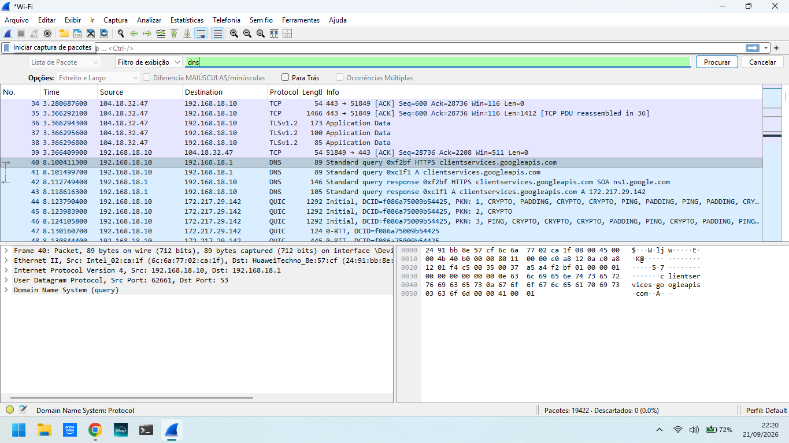
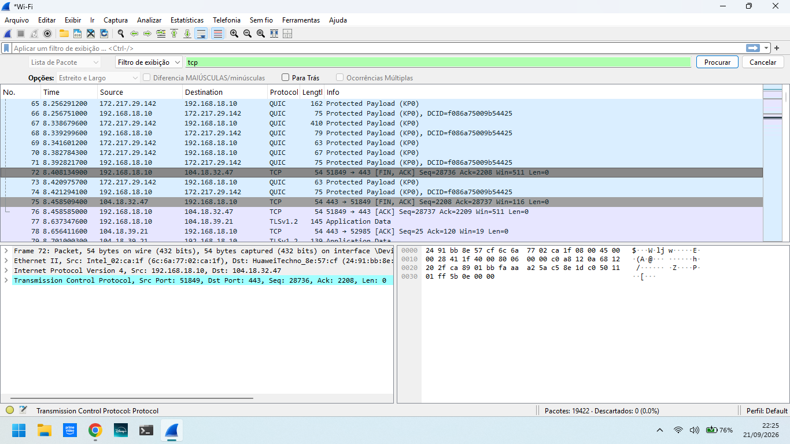
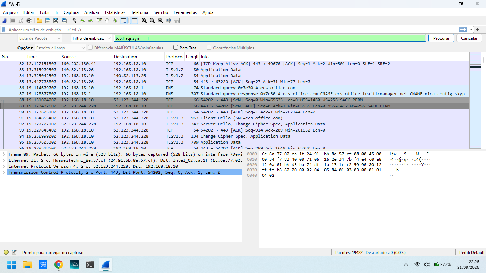

# 🔎 Wireshark Network Traffic Analysis

## 📌 Introdução

Este projeto apresenta uma análise de tráfego de rede realizada utilizando o Wireshark.

O objetivo foi observar, na prática, diferentes etapas da comunicação de rede, analisando consultas DNS, estabelecimento de conexões TCP e início de uma comunicação protegida por TLS.

## 🎯 Objetivos

- Analisar tráfego de rede
- Identificar protocolos de comunicação
- Analisar consultas DNS
- Observar o estabelecimento de conexões TCP
- Identificar endereços IP e portas
- Observar o início de uma conexão TLS
- Documentar os resultados utilizando evidências reais

## 🛠️ Ferramenta utilizada

- Wireshark

## 🌐 Conceitos analisados

- DNS
- UDP
- TCP
- TCP Three-Way Handshake
- TLS 1.3
- HTTPS
- Endereçamento IP
- Portas de comunicação

---

# 🔬 Análises realizadas

## 1. Análise DNS

Foi identificada uma consulta DNS para:

**clientservices.googleapis.com**

A comunicação observada apresentou:

- **Origem:** 192.168.18.10
- **Destino:** 192.168.18.1
- **Protocolo:** UDP
- **Porta de destino:** 53

A análise demonstra uma consulta DNS realizada pelo computador para o servidor DNS da rede.

### 📸 Evidência

---

## 2. Análise do TCP Three-Way Handshake

Foi observada uma sequência de estabelecimento de conexão TCP composta por três etapas:

**SYN → SYN + ACK → ACK**

A comunicação observada envolveu:

- **Cliente:** 192.168.18.10
- **Servidor:** 52.123.244.228
- **Porta do serviço:** 443

### 🔎 Interpretação

O pacote SYN inicia a conexão.

O servidor responde com SYN + ACK, indicando o recebimento da solicitação e confirmando a comunicação.

Por fim, o cliente envia ACK, completando o estabelecimento da conexão TCP.

### 📸 Evidência

---

## 3. Análise TLS 1.3

Foi observado um pacote TLS 1.3 do tipo:

**Client Hello**

A comunicação observada apresentou:

- **Origem:** 192.168.18.10
- **Destino:** 52.123.244.228
- **Porta de origem:** 54202
- **Porta de destino:** 443
- **Protocolo:** TLS 1.3
- **SNI:** ecs.office.com

O Client Hello representa o início da negociação TLS observada na captura.

### 📸 Evidência

---

# 📊 Resultados

Durante o laboratório foi possível observar uma sequência de comunicação envolvendo diferentes protocolos:

**DNS → TCP → TLS 1.3 → Comunicação protegida**

A análise permitiu relacionar os protocolos observados com suas respectivas funções na comunicação de rede.

Também foi possível identificar endereços IP, portas, protocolos e mensagens específicas dos protocolos analisados.

---

# 🧠 O que aprendi

Durante este laboratório aprendi a:

- Utilizar o Wireshark para capturar e analisar tráfego
- Utilizar filtros de exibição
- Identificar consultas DNS
- Identificar comunicação UDP
- Analisar o TCP Three-Way Handshake
- Identificar as flags SYN, SYN/ACK e ACK
- Identificar a porta 443
- Observar uma mensagem Client Hello
- Identificar uma comunicação TLS 1.3
- Documentar evidências de uma análise de rede

---

# 🚀 Próximos passos

Como evolução deste projeto, pretendo:

- Aprofundar a análise de protocolos de rede
- Estudar mais detalhadamente TCP/IP
- Analisar outros protocolos
- Estudar identificação de comportamentos anômalos
- Desenvolver novos laboratórios de segurança de redes
- Aplicar os conhecimentos em projetos de Cibersegurança

---

# 👤 Autor

**Felipe Esteves**

Estudante de Redes de Computadores

Foco em Cibersegurança e Segurança de Redes
