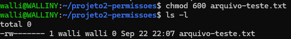
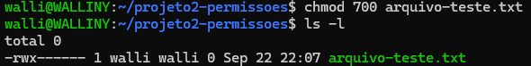
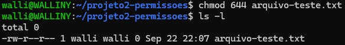

# Projeto 2 — Gerenciamento de Permissões de Arquivos Linux

## Objetivo

Este projeto demonstra, na prática, o uso de comandos Linux para
visualizar e modificar permissões de arquivos.

A atividade faz parte do desenvolvimento do meu portfólio de
segurança cibernética.

## Ambiente

- Ubuntu 24.04 LTS
- WSL 2
- Bash
- Windows 11

## Comandos utilizados

### Criando o arquivo

```bash
touch arquivo-teste.txt
```

### Visualizando permissões

```bash
ls -l
```

### Permissão 600

```bash
chmod 600 arquivo-teste.txt
```

Resultado:

```text
-rw-------
```

O proprietário possui permissão de leitura e escrita.
Grupo e outros usuários não possuem acesso.



### Permissão 700

```bash
chmod 700 arquivo-teste.txt
```

Resultado:

```text
-rwx------
```

O proprietário possui permissões de leitura, escrita e execução.
Grupo e outros usuários não possuem acesso.



### Permissão 644

```bash
chmod 644 arquivo-teste.txt
```

Resultado:

```text
-rw-r--r--
```

O proprietário possui leitura e escrita.
Grupo e outros usuários possuem apenas leitura.



## Entendendo as permissões

- `r` — leitura (read)
- `w` — escrita (write)
- `x` — execução (execute)

Os valores numéricos utilizados pelo `chmod` são:

- `4` — leitura
- `2` — escrita
- `1` — execução

Exemplo:

`7 = 4 + 2 + 1 = rwx`

`6 = 4 + 2 = rw-`

## Conclusão

Neste laboratório, pratiquei o uso do comando `chmod` para controlar
as permissões de acesso a arquivos no Linux.

A atividade permitiu compreender, na prática, a relação entre as
permissões numéricas e as permissões representadas por `r`, `w` e `x`.
